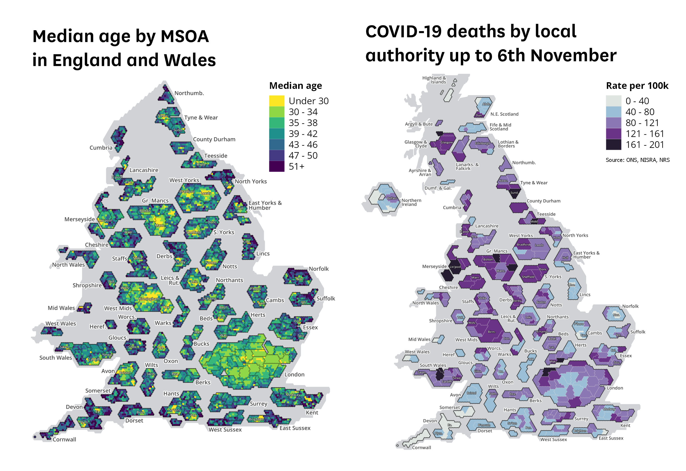
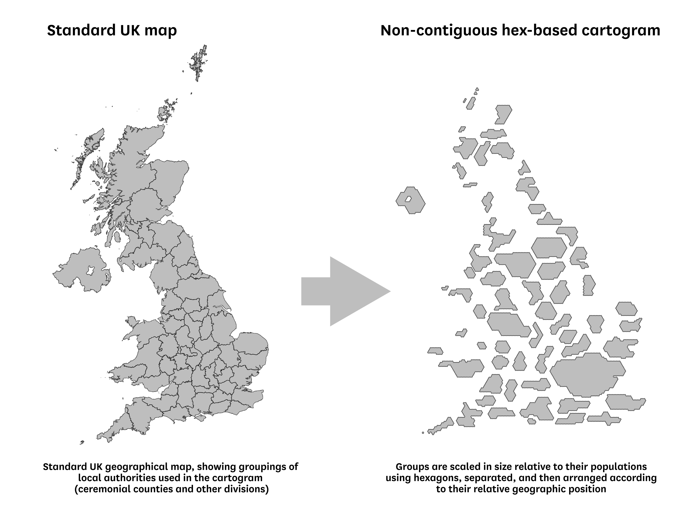
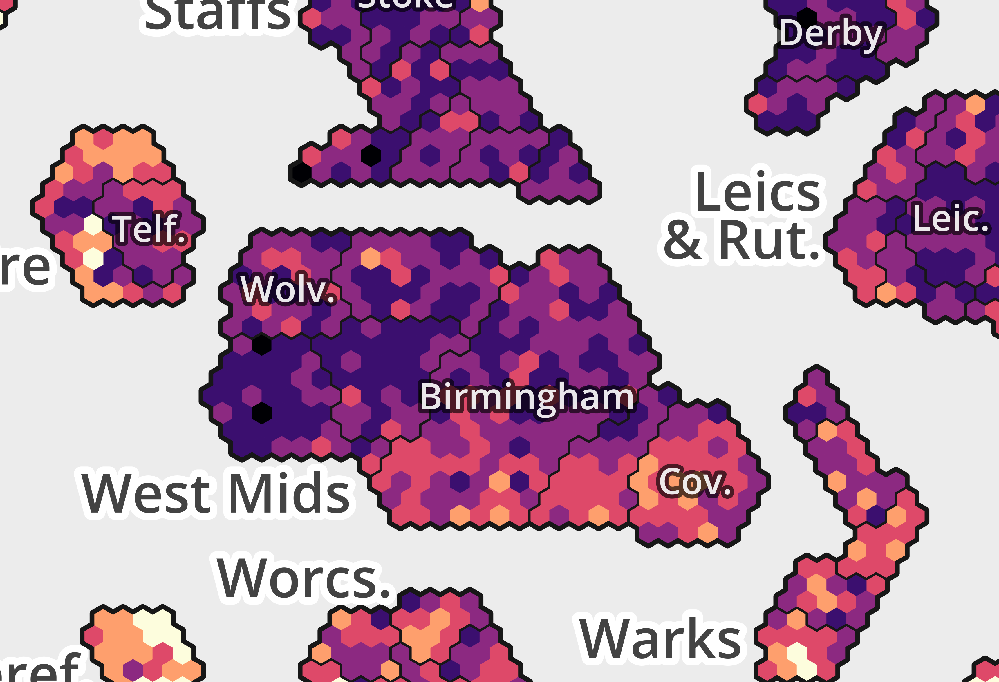
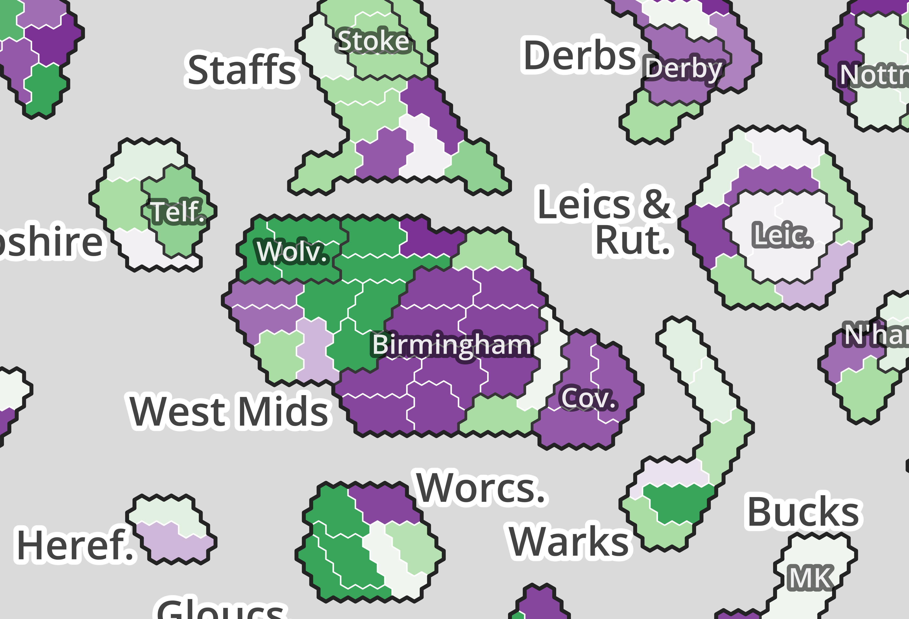
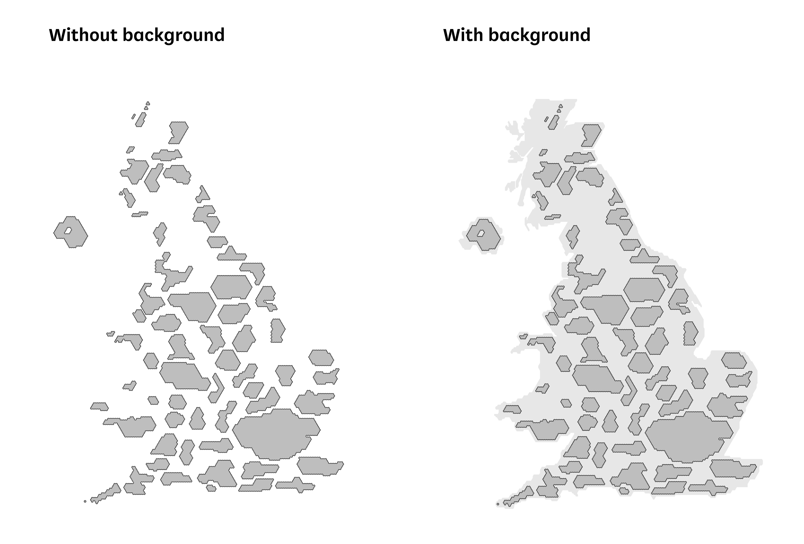
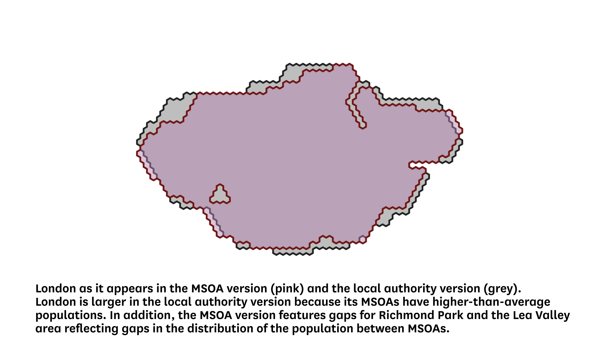
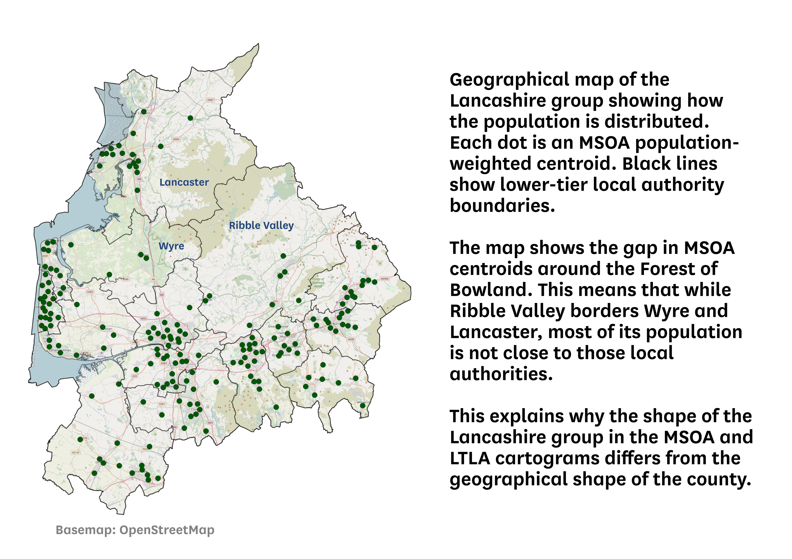
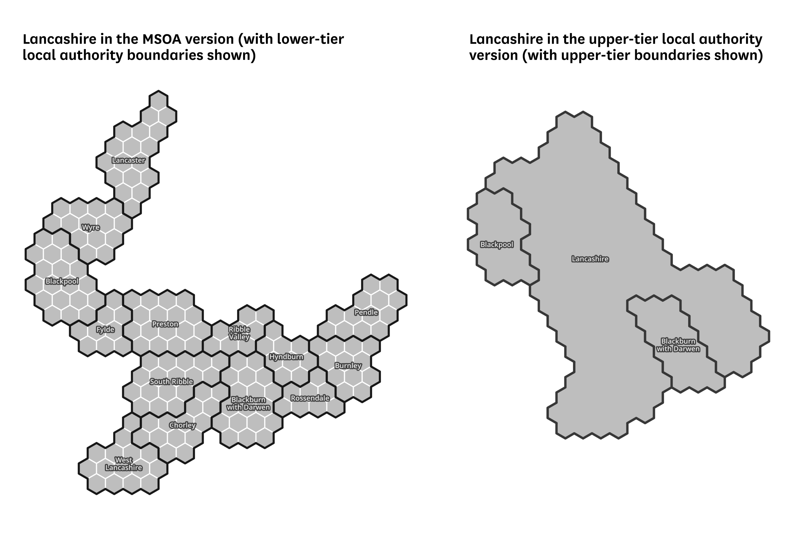

# uk-hex-cartograms-noncontiguous

This folder contains four geopackage files with geographical templates for **non-contiguous (‘exploded’) hexagon-based cartograms of the UK**. The data files are available for:

* MSOAs (Middle-Layer Super Output Areas) in England and Wales (2011 census)
* Lower-tier local authorities in the UK (2018, 2019 and 2020 boundaries)
* Upper-tier local authorities in the UK (2018, 2019 and 2020 boundaries)
* Westminster Parliamentary Constituencies in the UK (current boundaries at the time of publication).

**[Download the files here.](https://github.com/houseofcommonslibrary/uk-hex-cartograms-noncontiguous/archive/main.zip)**  

Two examples of visualisations using the templates are below. You can see some more examples of COVID-19 data visualisations using the formats [here](https://drive.google.com/file/d/1m5llZrxGsBYdaOJdXSdSKpmylFCu16aX/view), [here](https://drive.google.com/file/d/1Rm9BgAIc452nkRrUAt01cji61OlneJtk/view) and [here](https://drive.google.com/file/d/1tjm5C29oZWXTzcsoaZt8-hYdobTAaJ4d/view). This page explains the format in some detail.

[How to use](#1)  
[What is a non-contiguous hexagon-based cartogram?](#2)  
[Why use a non-contiguous cartogram and what about other options?](#3)  
[What kind of data can you use these templates for?](#4)  
[England: why ceremonial counties and where are they not used?](#5)  
[Scotland and Wales groupings](#6)  
[Labels](#7)  
[Background UK outline shape](#8)  
[Notes on the MSOA version, and some differences between the versions](#9)  
[How was this made?](#10)  
[Known issues](#11)
**[Download](https://github.com/houseofcommonslibrary/uk-hex-cartograms-noncontiguous/archive/main.zip)**  

## How to use  

When you load any of the geopackage files into a GIS program like QGIS, several layers will appear. The project CRS should be set to **EPSG:27700** (British National Grid) in order for the layers to display correctly. Each layer is pre-styled but you can adjust styles as you wish. To visualise data you will need to join data to the relevant cartogram layer (e.g. MSOA, LTLA 2018) using the normal method.

This data is licensed under the **[Open Parliament Licence](https://www.parliament.uk/site-information/copyright-parliament/open-parliament-licence/)**, which allows you to use the data in your products as long as you acknowledge the source of the information and, where possible, provide a link to the licence (see the link above or the licence file for full details).

We’d love to hear feedback on this resource, and how it’s been useful to you in your projects – do get in touch.

## What is a non-contiguous hexagon-based cartogram?
 

 
These cartogram templates differ from a normal geographical map as follows:

* First, areas are **grouped by [ceremonial county](https://en.wikipedia.org/wiki/Ceremonial_counties_of_England)** (in most English cases) and other recognisable sub-national geographical areas, as shown by the divisions in the left-hand map above. See below for more explanation on the county and other groupings used.

* Second, these groups are **adjusted in size relative to their population** - either directly (as in the local authority and constituency versions) or indirectly (as in the MSOA version, where one small hexagon represents one MSOA). This is the ‘cartogram’ element of the visualisation.

* Third, these groups are **separated (or ‘exploded’) and arranged according to their approximate geographic location** so that the resulting shape resembles the UK - as in the right-hand image above. This is the ‘non-contiguous’ element of the visualisation.

* Finally, the groups are presented as **stylised shapes composed of hexagons** and not as shrunken/increased versions of the actual geographical shapes. This is the ‘hexagon-based’ element of the visualisation. The exact shape for each group differs between the four versions of the template because of the different subdivisions within county groups (e.g. MSOAs, local authorities). This is also discussed below. 

In the MSOA version, each small hexagon within a county group represents a single MSOA. In the local authority and constituency versions, the shapes representing each local authority within a county group are composed of a number of small hexagons, with each small hexagon representing a population of around 8,000. Each area has the appropriate number of hexagons to represent its population. No fractions of hexagons are used, meaning that the scaling is effectively based on rounded populations.

In the MSOA version, MSOAs are arranged approximately geographically within the wider local authority shape, according to the relative position of their [population-weighted centroid](https://geoportal.statistics.gov.uk/datasets/b0a6d8a3dc5d4718b3fd62c548d60f81_0). Note that the MSOA version only includes England and Wales because Scotland and Northern Ireland have different, non-equivalent census geographical divisions.

Some county/sub-national groups are separated into multiple discrete shapes in order to reflect geographical features: e.g. Merseyside (a gap between Wirral and Liverpool to represent the Mersey) and areas with islands (e.g. a gap between Gwynedd and Isle of Anglesey in North Wales to represent the Menai Strait).

## Why use a non-contiguous cartogram and what about other options?

Cartograms can be a useful alternative to a geographical map for visualising data about people and places. Because geographical maps can visually overrepresent sparsely-populated areas and visually underrepresent dense urban areas, they sometimes give an incomplete picture of the underlying data. The most well-known example of this is probably the geographical USA election map, which notoriously [over-represents areas with few or zero residents](https://eu.usatoday.com/in-depth/graphics/2020/11/10/election-maps-2020-america-county-results-more-voters/6226197002/). Alternative cartogram versions adjust for population or electoral votes.

Choosing an appropriate cartogram always involves trade-offs and there is no one correct or perfect solution. While we are not aware of any extant MSOA cartogram templates, there are already other options available for mapping the UK using contiguous cartograms. The approach used here has certain advantages over other options, but also has disadvantages.

The main advantage of this template is that it is easy for readers to identify which part of the UK a particular shape relates to. Because county/subnational shapes are separated/exploded, they can labelled directly in the gaps between shapes. So it can be easier to pick out particular counties than on either a geographical map or a contiguous cartogram.

Using non-contiguous groups also makes it possible to arrange the overall shape to more closely resemble the UK, while keeping each area in its approximate geographical location. This can be hard to do for contiguous cartograms, which often have a trade-off between the accuracy of their overall shape and the geographical accuracy of individual hexagons.

When using a non-contiguous cartogram, the obvious trade-off is that contiguity between areas that occupy different counties/subnational groups is lost. For instance, the cartogram doesn’t allow you to easily see how neighbouring parts of Cumbria and Northumberland compare, and Leicestershire and Lincolnshire are not adjacent on the cartogram despite sharing a border. 

In addition, the gaps between groups in a non-contiguous cartogram are sometimes misinterpreted as being part of the data, or even as missing data. This format should probably be regarded as an “advanced” visualisation and requires more explanation and intellectual investment than geographical maps and perhaps also more than contiguous cartograms. It will usually be necessary to provide a written explanation or blurb alongside the visualisation to help readers interpret it. See an example [here](https://drive.google.com/file/d/1m5llZrxGsBYdaOJdXSdSKpmylFCu16aX/view) – a version of this blurb is also [included in the project folder](example-blurb.txt) for you to adapt. Using the cartogram [alongside an inset geographical map](https://twitter.com/carlbaker/status/1327190720088739840) is another way to help with these issues as it provides a familiar reference point for comparison.

[Contiguous hex-based cartograms](https://richardbrath.files.wordpress.com/2015/10/ukequalareatilemaps.png) are commonly-used in UK election analysis, providing a clear at-a-glance overview of election results by using one hex for each constituency. They are also sometimes used for [local authorities](https://olihawkins.com/2018/02/1), but these come with a major disadvantage as cartograms: because local authorities differ hugely in their populations (e.g. Birmingham has 1.1 million people and Rutland 40,000), some areas are still afforded a much larger or smaller visual space than their population justifies. So one key aim of a cartogram is not met, though the visualisation may still be worthwhile in other ways.

We hope these non-contiguous cartogram templates will provide a useful additional option alongside existing cartograms that others have made available.

## What kind of data can you use these templates for?

The templates are most useful for data about people and populations, because they use population size as the metric for adjusting the size of areas. They can also be used for many datasets concerning places, buildings, infrastructure, etc, because of the close correlation with population - although appropriate caveats should be used in those cases.

Because the shapes in these cartograms are related to population, the format is less useful for visualising datasets where land area or other physical features are important for interpreting the data. In those cases a geographical map would usually be more appropriate. 

Some caution is required when using the templates for any data that does not relate to the entire population, e.g. for particular age groups. The shapes are scaled according to the whole population, so a visualisation showing data for (e.g.) people aged 65+ using this template would under-represent areas with a high proportion of people in that group. While the template should still be usable for some cases like this, you should be sure to include caveats.

Finally, a word about constituency electoral data. The constituency cartogram template here is, like the others, scaled according to population. This means that not all shapes are equal in size, because constituency populations vary. 35 constituencies have populations above 130,000, while 39 have populations below 80,000, because constituency boundaries are determined using the registered electorate and not the total resident population.

Because of this, the constituency cartogram template here wouldn’t be appropriate for mapping most data about MPs, constituency winners in a general election, or any data where it’s important that each shape be equal. [We have an alternative one-square-per-constituency non-contiguous format](https://visual.parliament.uk/research/visualisations/general-election-2019-constituencies/) that will be published in the near future, and this would work better.

## England: why ceremonial counties and where are they not used? 

The non-contiguous groups used in England are mostly the same as the boundaries of [ceremonial counties](https://en.wikipedia.org/wiki/Ceremonial_counties_of_England). This means that some don’t reflect current local government structures, mostly with respect to unitary authorities. For instance, Nottingham is included in the Nottinghamshire shape even though it is a unitary authority and not part of the modern-day Nottinghamshire county. Similarly, Halton and Warrington unitary authorities are included in the Cheshire shape, Medway unitary authority is in the Kent shape, and Southampton and Portsmouth are in the Hampshire shape. 

This decision is to help keep the visualisation as simple as possible. A non-contiguous cartogram which separated all unitary authorities into their own discrete/exploded shapes, and labelled them separately, would be much harder to lay out effectively. It would also be much harder to interpret because of the many more separate groups.

However, the visualisation has several divergences from the ceremonial county structure in England which are explained below in turn. These involve the ‘East Yorkshire and Humber’, ‘Leicestershire and Rutland’, ‘Teesside’ and ‘Avon’ groups.

The **‘East Yorkshire and Humber’** group is composed of the four local authorities from the former Humberside county (North East Lincolnshire, North Lincolnshire, Kingston-Upon-Hull and East Riding of Yorkshire). This grouping is chosen to ensure that all groups in England contain local authorities from at most one region. If the ceremonial county of Lincolnshire was used instead (i.e. including North Lincs and North East Lincs with the modern-day county of Lincolnshire), then the resulting group would include parts of two regions: East Midlands and Yorkshire & Humber.

The **‘Leicestershire and Rutland’** group contains Leicester unitary authority, Leicestershire county council area and Rutland unitary authority. Rutland is not part of Leicestershire ceremonial county. But since it is a small county in an already crowded area of the visualisation, it is easier to group it with another county than to separate it. Leicestershire is the obvious candidate for this grouping because the two counties are already associated with one another for some administrative purposes (e.g. [fire service](https://leics-fire.gov.uk/) and [NHS commissioning](https://eastleicestershireandrutlandccg.nhs.uk/)). The ‘Rutland’ name is included in the abbreviated form of the group label (‘Leics. and Rut.’) to indicate that the group contains two ceremonial counties and that Rutland is not part of Leicestershire.

**‘Teesside’** is not a ceremonial county but is included as its own group. It consists of the five local authorities that make up the modern-day ‘Tees Valley’ city region area: Darlington, Stockton-on-Tees, Hartlepool, Middlesbrough, and Redcar & Cleveland. The name ‘Teesside’ is used rather than ‘Tees Valley’ because the latter is relatively new as an administrative name and may be less recognisable outside of the local area than ‘Teesside’. But we would welcome feedback on this naming choice. Note that in the constituency version, Sedgefield constituency is included in the County Durham group despite including a portion of Darlington local authority.

The **‘Avon’** group is composed of the four local authorities making up the former county of Avon (Bristol, South Gloucestershire, Bath & North East Somerset, North Somerset). The county of Avon no longer exists, although the name is still used by some official organisations (e.g. [NHS](http://www.awp.nhs.uk/), [police](https://www.avonandsomerset.police.uk/)). The Avon name is used here because it’s the best short name available to describe this set of four local authorities. The grouping of these areas was chosen because none of the alternative options available is ideal - these issues are described below.

One alternative would have been to use the ceremonial county divisions (i.e. keep **Bristol** on its own and move the other areas to their respective ceremonial counties - **Gloucestershire** and **Somerset**). This is not ideal because the city of Bristol forms a single built-up urban area with parts of South Gloucestershire. On the MSOA map, in particular, it would be suboptimal to separate (e.g.) Horfield from Filton or Mangotsfield from Fishponds by a large gap, when these areas are part of the same built-up area.

Another alternative would have been to have a group that matches the current-day **‘West of England’** [combined authority](https://www.westofengland-ca.gov.uk/). This includes three of the four Avon areas but does not include North Somerset. However, names like ‘West of England’ and **‘West Country’** can be used to refer to a wide geographical area not limited to these three local authorities (e.g. Wiltshire, Somerset), so this may lead to confusion. In addition, the resulting Somerset group, including North Somerset but not Bath & North East Somerset, would represent neither the modern-day county council area nor the ceremonial county area.

One more promising alternative option would be to keep Bristol and South Gloucestershire together as a single group and move the two other areas to the Somerset group. This is the approach we took in our [General Election 2019 cartogram](https://visual.parliament.uk/research/visualisations/general-election-2019-constituencies/). This has the advantage of removing the defunct ‘Avon’ name. It would change the Somerset group from one which represents the current county council area to one that represents the ceremonial county area. It has the disadvantages of separating areas that are part of the same combined authority (Bristol and Bath) and of introducing a somewhat artificial group whose name references two specific local authorities (**‘Bristol & South Gloucs’**). **We would welcome feedback** on whether you think this alternate division would work better than the one currently used on the map templates.

One other group name deserves comment. The **‘West Midlands’** group relates to the [constituent area of the combined authority](https://www.wmca.org.uk/who-we-are/) and not the wider West Midlands region (which includes Warwickshire, Staffordshire, Shropshire, Herefordshire and Worcestershire as well as the metropolitan area centred on Birmingham). This could cause some confusion, but we hope that the presence of adjacent labelled groups representing the other five counties in the region will alleviate this. No obvious alternative name is available to describe the ‘West Midlands’ group.

## Scotland and Wales groupings

For the most part, areas in Scotland and Wales are not grouped by traditional or ceremonial counties on this visualisation because those areas don’t always correspond neatly to modern-day local authorities.

Wales is divided into four groups: **South Wales** (encompassing everything south of Powys, as far west as Swansea), **West Wales** (Carmarthenshire and Pembrokeshire), **Mid Wales** (Powys and Ceredigion) and **North Wales** (all remaining local authorities). These names don’t have strict geographical definitions, so it’s possible that readers won’t always be able to identify which local authorities are in which group.

Scotland’s group divisions differ slightly between the local authority and constituency versions because of the way that constituency boundaries differ from local authority boundaries. The main groups shared between the two versions are as follows:

* **Lothian and Borders** (Edinburgh, West Lothian, East Lothian, Midlothian and Scottish Borders)
* **Fife and Mid Scotland** (Fife, Stirling, Perth & Kinross and Clackmannanshire - matching the [electoral region of a similar name](https://en.wikipedia.org/wiki/Mid_Scotland_and_Fife_(Scottish_Parliament_electoral_region)))
* **Lanarkshire and Falkirk** (similar to the [Central Scotland electoral region](https://en.wikipedia.org/wiki/Central_Scotland_(Scottish_Parliament_electoral_region)))
* **Glasgow and Clyde** (matching the [Greater Glasgow & Clyde NHS board area](https://en.wikipedia.org/wiki/NHS_Greater_Glasgow_and_Clyde))
* **North East Scotland** (Dundee, Angus, Aberdeenshire, Aberdeen City and Moray)
* **Highland and Islands** (Highland, Orkney, Shetland and Na h-Eileanan Siar)
* **Argyll and Bute** as its own separate group because it doesn’t fit neatly any of the other groups.

Additionally, in the local authority version, there is an **Ayrshire and Arran** group and **Dumfries & Galloway** sits alone as a separate group. In the constituency version, Dumfries and Galloway constituency - which only covers part of the local authority of the same name - is grouped with Ayrshire into a wider **‘South West Scotland’** group. 

In the constituency version, the **Lanarkshire and Falkirk** group includes the Dumfriesshire, Clydesdale and Tweeddale constituency. This constituency is split between South Lanarkshire, Scottish Borders, and Dumfries & Galloway local authorities. Positioning it under Lanarkshire is arguably a better reflection of its geographical position than other options.

The ‘Linlithgow and East Falkirk’ constituency is split between Falkirk and West Lothian local authorities. It is placed in the **Lothian and Borders** group in the constituency version.

The relationship between [Scotland’s population geography and its physical geography](https://twitter.com/cj_maps/status/1329761395001487363) means that it’s more challenging to arrange population-scaled groups in a way that results in a shape that resembles the country. For a similar cartogram covering just Scotland, a different approach with more groups might work better (e.g. separating out all local authorities individually rather than grouping some together).

## Labels

The templates include labels for county/sub-national groups (e.g. ‘Notts’, ‘Norfolk’). This is provided as a point layer, and the position of the label in relation to the point is determined by a “left/right/ column in the attribute table. These labels are will usually be necessary to include on the visualisation because they allow readers to identify which area each shape refers to. Many of these labels use standard abbreviations of county names (e.g. ‘Staffs’, ‘Hants’); some of these may be less familiar than others (e.g. ‘Warks’ for Warwickshire) but the limited space available doesn’t allow for full names in most cases.

The templates also include labels inside shapes to denote selected major cities and towns, as shown in the example below. These are intended to help readers navigate within each county/sub-national shape (while the group labels only help readers navigate between each shape). Because the relative distribution of areas within counties is somewhat unfamiliar (e.g. sparse rural areas will appear much smaller and dense cities much bigger) this helps to add context. These labels are attached to the relevant local authority layer, which includes a field called ‘LA label’. They all represent a local authority name and are abbreviated in most cases. While most abbreviations are unambiguous, they do require some knowledge of UK cities and towns to interpret.

Unlike the group labels, these are not an essential element of the visualisation, and other approaches could be taken. Adding these labels is clear a trade-off because they can obscure some data (especially on the MSOA version).

*City and town labels on the MSOA template*

The constituency map takes a slightly different approach to city/town labels. In the local authority and MSOA versions, a city/town label relates to a local authority boundary that is visible on the map. But in the constituency version, the city of Birmingham (for example) is composed of a number of constituencies, so simply adding a label may not adequately indicate which constituencies it refers to because the outer boundary of Birmingham is not itself visible.

To help with this, a further layer of shapes is included that outlines the constituencies falling within cities and towns, alongside labels. These are shown in the example below. These inset groups include some constituencies that aren’t located entirely within the boundaries of the cities shown - ‘Southampton’ includes the Romsey & Southampton North constituency and ‘Norwich’ includes Norwich North, which extends beyond the boundary of Norwich City Council. Like the other city/town labels, these are not an essential part of the visualisation and can be adapted or disabled as you wish.

City and town labels on the constituency template

 

## Background UK outline shape

Each file includes a ‘background’ layer that provides a schematic and stylised outline of the UK. This is to aid readers in interpreting the map. While the county/subnational groups are arranged in a shape that approximately resembles the UK, we had some feedback that it doesn’t necessarily look enough like the UK on its own to look as familiar as it should. The background helps by (a) making it more obvious that the visualisation is of the UK and (b) allowing readers to ‘navigate’ around the map using familiar geographical cues that aren’t otherwise clearly present (e.g. the shape of the Wales coast, the Humber estuary).

This background layer is composed of three polygon features (England and Wales, Scotland and Northern Ireland) which can be disabled selectively depending on which part of the UK you’re visualising.

The Great Britain element of the background shape is a contiguous polygon, unlike Great Britain itself which has islands. So the Isles of Wight, Anglesey, and Arran are all inside the background shape and the sea area between the mainland and the islands is not represented. This is because the background UK shape represents the outer border of the visualisation area, and to introduce discontinuity in it - apart from the separation between Northern Ireland and GB - would likely lead to more confusion. Remember that this background is only a schematic outline and isn’t intended to fully represent the coastline.

This issue has a larger effect on the Scottish Islands. Orkney, Shetland and Na h-Eileanan Siar are located adjacent to Highland, but separated by a small gap to reflect their island status (as noted in the introduction above). However, placing them adjacent to Highland also requires placing them inside the shape which appears to represent the mainland. An alternative would be to alter the shape of the top end of the Scotland background so that it doesn’t just represent the mainland, but without also moving the Highland and Islands shapes very far apart, this would be likely to make the overall Scotland background shape less recognisable.

A disadvantage of using a background UK shape is that it can exacerbate one problem we mentioned above - that of readers misinterpreting the ‘gaps’ as being missing data or areas where no data is shown - because there is now a visual distinction between the grey background areas and the wider white page background. For instance a reader might think that the Norfolk shape doesn’t include data for King’s Lynn (because the shape doesn’t cover the area on the UK background that they would associate with King’s Lynn) As before, we think that displaying the cartogram alongside an inset geographical map can help address this. You can also [include a specific line](https://drive.google.com/file/d/1m5llZrxGsBYdaOJdXSdSKpmylFCu16aX/view) in the “blurb” where possible saying that the grey background does not represent data. 

The decision of whether and how to use the background shape depends on how you think these issues trade off against the increased clarity of including a more direct representation of the UK shape.

## Notes on the MSOA version, and some differences between the versions

As stated in the introduction, the MSOA cartogram assigns one small hexagon to each MSOA. As a [census geography](https://www.ons.gov.uk/methodology/geography/ukgeographies/censusgeography), MSOAs had broadly similar populations at the time of the 2011 census. But they do not have identical populations - [as of 2019](https://www.ons.gov.uk/peoplepopulationandcommunity/populationandmigration/populationestimates/datasets/middlesuperoutputareamidyearpopulationestimates), 10% of MSOAs had populations of 6,000 and below, and more than 10% of MSOAs had populations above 10,000. Despite this, the MSOA cartogram represents each MSOA as being the same size. This is for visual simplicity. A graphic which scaled MSOA hexagons in size based on the population of the MSOA would be problematic as the hexagons would no longer tessellate. Any solution to this would be more complex and probably harder to interpret than the visualisation here.

Because the local authority and constituency templates are scaled directly based on population, unlike the MSOA template, this leads to differences between the templates. For example, in London, the average MSOA population is 9,117 compared with 7,959 in England and Wales as a whole. This means that in the local authority and constituency versions, London occupies a larger space on the visualisation than it does on the MSOA version - as shown in the image below. In some parts of the country, the opposite is the case.

In the MSOA cartogram, as mentioned previously, individual MSOAs are arranged approximately geographically within wider local authority shapes as far as is possible. Because the “population shape” of a local authority - the way its population is distributed - can differ markedly from its geographical shape, this means that local authorities and counties in the MSOA cartogram don’t always resemble their geographical shape very closely.

Lancashire is one example of this. As the first image below shows, its population is unevenly distributed around the county, with a gap around the Forest of Bowland. In addition, Ribble Valley has only a few MSOAs, is sparsely populated, and borders several other local authority areas. In a contiguous group of hexagons, it’s not possible to reflect all of this while maintaining the shape of the county. So the resulting Lancashire MSOA shape (shown on the left of the second image below) reflects the ‘population gap’, and does not place Ribble Valley adjacent to either Wyre or Lancaster, because its population is closer to Preston, Blackburn and Hyndburn. The resulting shape differs from the geographical shape of Lancashire. (Note that MSOAs in the same local authority are always placed adjacent to one another in a single group.)

However, in the other cartograms - especially the upper-tier local authority version - the lowest level of division is less fine-grained, meaning that the hex-based shapes can more closely resemble the geographical shape of the county. The right-hand example in the image below shows the shape of Lancashire in the upper-tier local authority cartogram. It is a stylised version of the county’s geographical shape because, unlike the MSOA version, there is no need for the shape to reflect the population distribution.

## How was this made?  

The MSOA cartogram was made by aligning [MSOA population-weighted centroids](https://geoportal.statistics.gov.uk/datasets/b0a6d8a3dc5d4718b3fd62c548d60f81_0) to a hex grid in QGIS. This involved manual work to get an arrangement that was both geographically acceptable and aesthetically acceptable. The other versions were produced by iterating on the MSOA version - by adding and removing hexagons as required to produce the correct population equivalent for each area, and then re-arranging the shapes.

## Known issues

While the MSOA cartogram layer includes coordinates in the ‘X’ and ‘Y’ data fields, these are currently not in an integer format that could be easily reused outside of GIS software. In a future version we will adapt these to a standard hex coordinate format.

